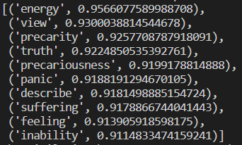

# Research Question 1

By means of the Word2Vec model provided by Gensim, we could make inferences of similarities between words. It emerges that the word "entreprecariat" has a strong connection with the word "youth" and a weak connection to the word "work". Furthermore, by querying our model we found out that the ten words most similar to "enterprecariat" are the following:

&#x20;

The code with the queries is available on our Github [repository](https://github.com/Entreprecariat/Entreprecariat) or you can download it from there:



Answer: we can confirm our expectations, declaring that entreprecariat is a new condition different from the traditional concept of work. It is related to the concept of "precariaty" and "precariousness", but also to some negative adjectives as "panic" and "inability".&#x20;

Insights: since it is a phenomenon that our corpus relates strictly to the youth, what is not present are the audults, and even more the elderly. There is a higher probability that, since elderly started to work in previous circumstances, they had permanent contracts or a fixed job, out of the flexibility requested by the current market. They still relate to the old concept of 'precariat' as 'intermittent employment', while entreprecariat is more similar to a lyfestile. It is not related anymore to the kind of contract (fixed-term, permanent etc.) but to the fact that it permeates every aspect of the lyfe of the worker.
