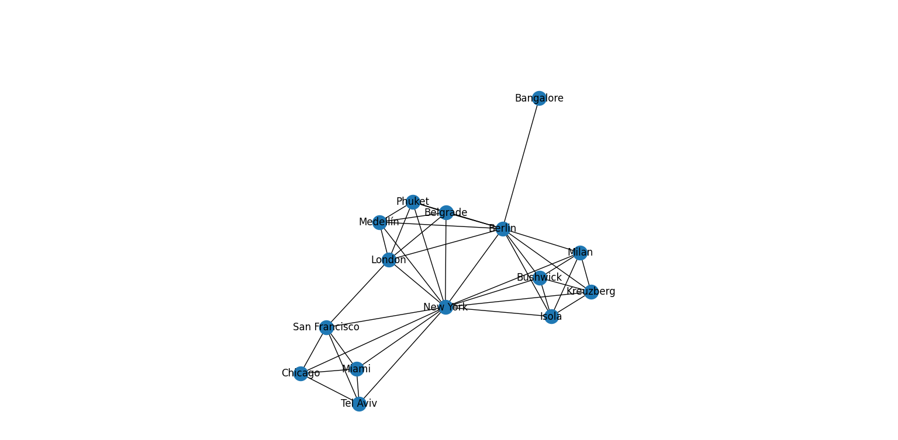

# Research Question 3

Through our network analysis it is possible to state that the actors identified by Silvio Lorusso in the world of entreprecariat-ism are well-defined and related to the big companies that rules the labour market in the west. However, even if those companies are mostly American, the places cited in the book are various and distributed in the whole surface of the word.

<figure><figcaption>
An example of a graph component from the network of places cited in the book "Entreprecariat" of the variery of places
</figcaption></figure>

Answer: If on one hand the entreprecariat-ism is a social phenomenon in which people and organizations from the West have an active role, we can infer from our data that repercussion are on a global scale

A further development of this hypothesis could be to identify if those actors are ruling the labour market, i.e., they cause enterprecariatism, or if they are following a social phenomenon, i.e. entreprecariatism is caused by other social factors.
