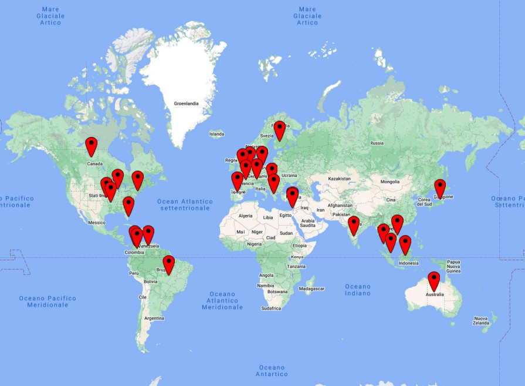

# Research Question 3

Through our network analysis it is possible to state that the actors identified by Silvio Lorusso in the world of entreprecariat-ism are well-defined and related to the big companies that rules the labour market in the west. However, even if those companies are mostly American, the places cited in the book are various and distributed in the whole surface of the word.

<figure><figcaption>
The map of cities and states cited in the book "Entreprecariat"
</figcaption></figure>

Answer: If on one hand the entreprecariat-ism is a social phenomenon in which people and organizations from the West have an active role, we can infer from our data that repercussion have a wider spread, even if not global. In particular we can observe that the places cited correspond to the places that are technologically advanced.&#x20;

Insights: since from the name-entity recognition on the book Entreprecariat the people involved are the founders or stricly related to the organizations and the places overlaps with the companies' offices, we can state that somehow the entities are few and well-defined. It delineates a phenomenon stricly related to information and technology. As some sociologists said, we are moving from a world ruled by money to a world ruled by information. However, this power held by the ones who spread the information delineates a completely different figure of enterpreneur who is not anymore able to plan and invest in one idea, but must be flexible and able to change path constantly. This is perceived as precarism, even though it is not an opposition between employment/unemployment but a continuous change of work that can include states of unemployment.&#x20;
