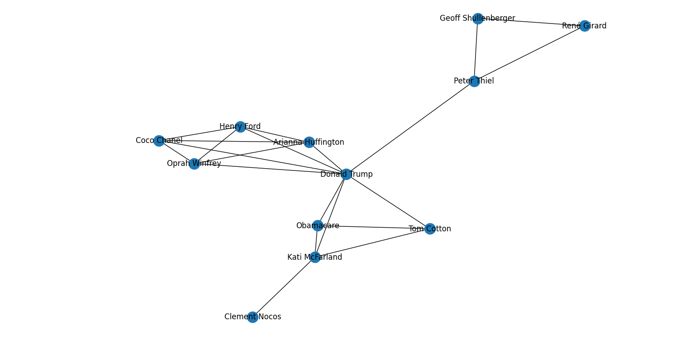
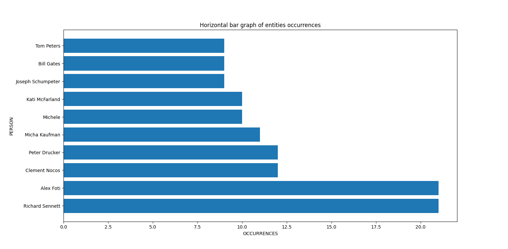

# a. People

The network of people cited in "Enterprecariat" is composed of different components. Two of the most interesting are shown below:&#x20;

<figure><figcaption>
Component of the social network of the book "Entreprecariat". It is interesting the centrality of Donald Trump.
</figcaption></figure>

<figure><figcaption>
Another component from the social network of "Entreprecariat. A interesting triad is the one composed by Bill Gates, Elon Must and Steve Jobs.
</figcaption></figure>

Those patterns, however, show associations that come out from the point of view of the author. A more interesting visualization is the horizontal barchart that can show the most cited people of the book, giving a more objective overview on the actors involved in these social changes:

<figure><figcaption></figcaption></figure>
