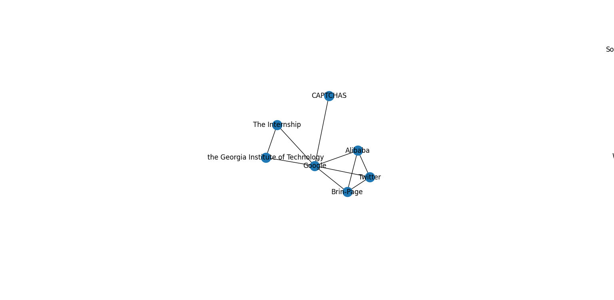
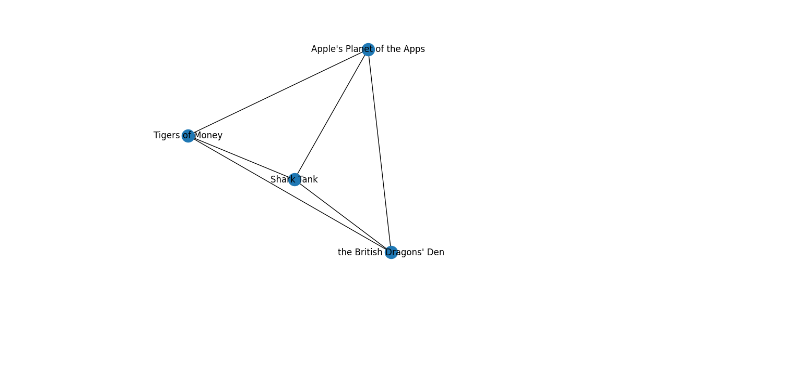
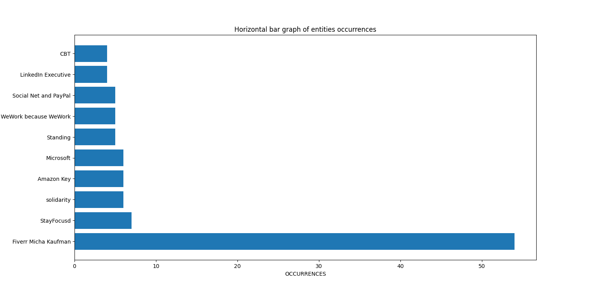

# b. Organizations

As for the people, some components emerged from the **network of the organizations**:&#x20;

<figure><figcaption>
A network of organizations with Google as centre.
</figcaption></figure>

<figure><figcaption>
A very strong component made of triads.
</figcaption></figure>

Below the horizontal barchart with the ten most cited organizations:

<figure><figcaption></figcaption></figure>

It is interesting to underline that Fiverr is definetly the most cited organization inside the book.
