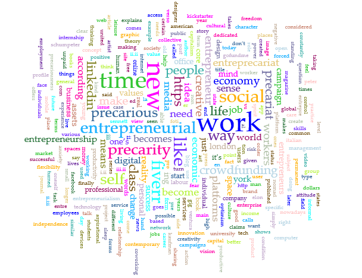
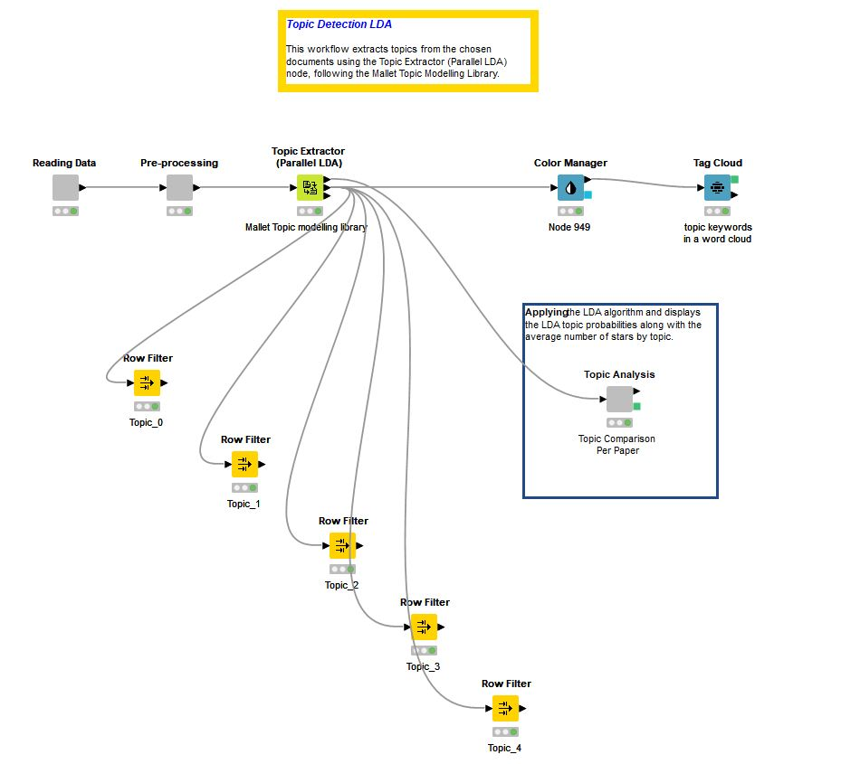
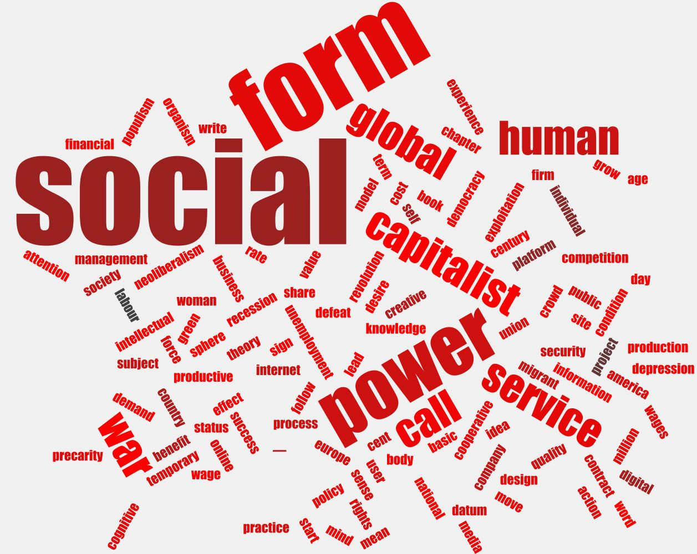

# Topic modelling

## The perspective remains alien but interpretable

> _The meanings of words are found in their contexts, and the Ngram Viewer provides only a small peephole into context._
>
> _What is needed in order to capture theme are collocations of collocations on a much larger scale._
>
> _(Jockers 2013, 148)_

Starting from this considerations we decided to procede with the **topic modelling**.

> _Topic models are, to use a familiar idiom, the mother of all collocation tools. (Jockers 2013, 148)_

> _Topic models explore and summarize document collections outside the context of any specific information need, when **we do not necessarily know what we are looking for**. (Boyd-Graber 2017, 21)_

At the very beginning of a data-related work it can be useful to have first some visual rendering of our raw data.

<figure><figcaption>
Word cloud of the book "Entreprecariat" during the very first exploratory data analysis. Made in voyant-tools.org.
</figcaption></figure>

A very first close attempt to the book is the **word cloud**, in which it is possible to see the most frequent word in the entire book, before the preprocessing of its text.

It is remarkable to say that the **exploratory data analysis** represents an evergreen step in text automatic inspection, that has been exterted for this research various times not only to have a visual hint, but to compare results from different processes and for mutual counter-proofs.

**\[TOPIC]** Here the "topic" in modelling is to be intended following the **statistical meaning** of the term, for which a "learning topic hierarchy" consisting in word->topic->document can be obtained through the pipeline described afterwards; hence, we do not define the level of abstraction formally, but we rely on the previous statistical language processing literature to design the aforementioned system.&#x20;

****

<figure><figcaption>
KNIME pipeline for topic detection. Here the grey nodes (i.e. modules) inglobe the preprocessing structure
</figcaption></figure>

**\[FRAMEWORK]** As advanced in [this paper](https://www.tandfonline.com/doi/abs/10.1080/19312458.2018.1430754) and many other resources, the framework here adopted follows a three step pipeline:&#x20;

* pre-processing
* topic modelling
* post-processing

In the last step the topic model **Latent Dirichlet Allocation** (unsupervised machine-learning model) is used, enriched by the **Mallet TM library**. Transparency and reliability to exploit the hidden semantic structure in documents has been provided through the fine tuning of the parameters, set by subjective decision. It is important to state here that the LDA algorithm is stochastic, hence the corpus has been associated to 5 topics, each of which has generated 25 words, taken from the corpus itself.

**\[DYNAMIC]** Furthermore, we'd like to prominently recall the "dynamic" characteristic of topic modelling to linger its **generative approach** and its keen eye on **innovation-oriented contexts**.

New documents of semantic and syntactic similarity between words are obtained directly from input data and specifically drawn through a **dependency structure** made available by the [word embedding process](wordEmbedding.py). In this sense, the Topic Modelling pipeline includes the [corpus](the-project/corpus.md).

**\[MODELLING]** The real strenght of topic models here relies on "tracking down this otherness hidden in language (and, perhaps, in what language talks about)" ([_Reading Machines_](bibliography.md)). Through a careful job of fine tuning, **5 topics** have been retrieved from the analysis. Though has been decided to mantain certin words in more than one topic, to avoid a large number of repetitions the preprocessing has been enriched making some tests in lemmatizing and stemming of the documents.

Technical Specifications: 

No. of topics: 5 

No. of words per topic: 25 

Alpha (- the distribution of - the number of words per topic): 0,4 

Beta (- the distribution of - the number of topics per document): 0,1 

No. of iterations: 2000 

No. of threads: 8

<figure><figcaption>
Word cloud obtained from the Topic Detection
</figcaption></figure>

**\[EDITING AND CURATION]** As a matter of fact, the process aimed to reach the most valuable index of held-out likelihood in order to prevent over/underf fitting. Meaning that we got our hands into practically **tuning the aspects of interest through the whole pipeline**. For example, here we don't mean to rely on chapters division-based modelling, and we choose to add some nouns into the stop words collections, since it was resulting irrelevant for the initial purpose of the process (see for more [here](https://link.springer.com/article/10.1007/s10994-013-5413-0)).

Topics have been detected as follows:

* Topic\_0: POLICY
* Topic\_1: SHARING\_ECONOMY
* Topic\_2: ENTREPRECARIAT\_LIFE
* Topic\_3: CAPITALISM\_CRISIS
* Topic\_4: ZEITGEIST

**\[AREAS OF POTENTIAL INTEREST]** As stated in the Research Question [chapter](the-project/research-questions.md), we asked ourselves: how can we manage to put a spot on the **neologism**, treating the book as an innovative piece of literature?

While going on with through the work practice, we encountered an interesting piece of research from of the most relevant personalities in the field of topic modelling, i.e. professor David Mimno that, together with [other researchers](bibliography.md), explains how topic modeling for scientific papers differs in some ways from that related to fiction books.

Indeed, the attention towards innovative topic is not rarely found in scientific research paper studies; in that case it is shed a light on new techniques, new understanding, new terminologies provided by the text.

To consider the book "Entreprecariat" as a vademecum of the zeitgeist means leafing through it with a look on politics and social life not only of the Western World.

We talked about the [possible future imporvements](conclusions.md) of the projects, but we can clearly state that **innovation is hard to detect and attribute**. It involves _communities, theories and practices and different methods,_ as we [assumpt](the-project/introduction.md) from the beginning.

**\[CONNECTING THE DOTS]** For what said until now, topic modelling approaches entered the work flow phisiologically, since it is based on the so-called "posterior inference", i.e. a practice clearly based on input data.

**The act of inferring here is a pure act of reverse engineering**, than excellent when it comes to connecting the dots between topic models. Finally, we can say that topic modelling is a way of "Operationalising the concept of Distant Reading" ([Applications of Topic Models](bibliography.md)), or in Moretti's words:

> _**Taking a concept, and transforming it into a series of operations (Moretti, 2013)**_
